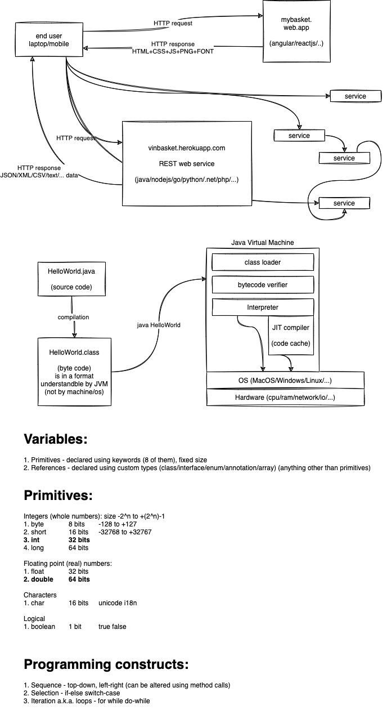

# Java bootcamp training for Target - September 2021



# Assignments for Day 1

### Assignment 1

Implement the body for the following function:

```java
static boolean isValidDate(int year, int month, int day) {
	// do stuff here
	return false;
}
```

The function should check if the parameter values constitute a valid calendar date or not. Accordingly return true or false.

For example,

1. year=2018, month=13, day=1 is an invalid date as the possible values for month is 1 to 12.
2. year=2018, month=2, day=29 is an invalid date as the maximum days in February is 28 in the year 2018
3. year=2016, month=2, day=29 is a valid date.

Write a Java program to call the above function multiple times with different values.

---

### Assignment 2

Implement the body for the following function:

```java
static boolean isPrimeNumber(int num) {
	// do stuff here
	return false;
}
```

The function should check and return true only if the number passed as argument is a prime number.

Write a Java program to call the above function multiple times with different values.

---

### Assignment 3

Write a function called "sortThreeNumbers", which takes 3 distinct integers and prints them in ascending order.

```java
public void sortThreeNumbers(int a, int b, int c) {
	// do stuff here
}

```

For example,

-   sortThreeNumbers(2, 10, 1); // prints 1, 2, 10
-   sortThreeNumbers(20, 10, 1); // prints 1, 10, 20
-   sortThreeNumbers(2, 10, 100); // prints 2, 10, 100 and so on.

Write a Java program to call the above function multiple times with different values.

---

### Assignment 4

Write a function called "sumOfPrimes", that takes two integers as input and returns the sum of all the prime numbers between the same.

```java
public int sumOfPrimes(int from, int to) {
	// do stuff here
	return 0;
}
```

Write a Java program to call the above function multiple times with different values.

---

### Assignment 5

In mathematics, the Fibonacci numbers are the numbers in the following integer sequence, characterized by the fact that every number after the first two numbers is the sum of the two preceding ones:

0, 1, 1, 2, 3, 5, 8, 13, 21, 34, 55, 89, 144, ...

Write a function called "fibonacci", that takes index as paramter and returns the fibonacci number at that index.

```java
public int fibonacci(int index) {
	// do stuff here
	return 0;
}
```

---

### Assignment 6

Write a Java program to print the following pattern:

```
*
**
***
****
*****
```

The number of rows should be based on the value of a variable "num", and the number of stars in a row is based on the row number itself.

---

### Assignment 7

In trignometry, the Sine of an angle is represented by the series below:


Write a Java function that accepts angle in degrees and returns the sine of the given angle.

Call the function in main, multiple times by supplying multiple values and verify the same.

PS:

-   Divide the function into small reusable functions, if possible.
-   Do not use builtin Java classes like `Math`

---

### Assignment 8

Implement the Java function listed below:

```java
public static void printCalendar(int month, int year) {
	/// do stuff here
}
```

The function should accept `month` and `year` and print the calendar for the same. If inputs are invalid, appropriate error message/s should be printed.

Sample output for the inputs (8, 2018):

```
Su Mo Tu We Th Fr Sa
          1  2  3  4
 5  6  7  8  9 10 11
12 13 14 15 16 17 18
19 20 21 22 23 24 25
26 27 28 29 30 31
```

PS:

-   Do not use any builtin Java classes like `Date` or `Calendar`
-   Divide the function into small reusable functions, if possible.

---

### Assignment 9

Write a function called "sumOfEvensAndOdds", that takes an array of integers as input and returns another array of integers of length 2. The first element in the returned array is the sum of all even numbers in the input array, and the second element in the returned array is the sum of all odd numbers in the input array.

```java
public int[] sumOfEvensAndOdds(int []nums) {
	// do stuff here
	return null;
}
```

For example,

```java
int [] nums = {1, 2, 3, 4, 5, 6, 7, 8, 9, 10};
int [] result = sumOfEvensAndOdds(nums);
// result should be equal to {30, 25}
```

Hint:

An arrays is created as shown below:

```java
int []arr = new int[2];
arr[0] = 12;
arr[1] = 100;
```

or

```java
int []arr = {12, 100}
```

Call the function in main, multiple times by supplying multiple values and verify the same.

---

### Assignment 10

Write a function called "reverseByWords", that takes a sentence (string) as an input, and returns another string. The return value must be a sentence in which the words in the original sentence appear in reverse order.

```java
public String reverseByWords(String sentence) {
	// do stuff here
	return null;
}
```

For example,

```java
String out = reverseByWords("my name is vinod and i live in bangalore");
// the variable "out" should be equal to "bangalore in live i and vinod is name my".
```

Call the function in main, multiple times by supplying multiple values and verify the same.

---

### Assignment 11

Write a function called "inWords" that takes a number between 1 and 99,99,99,999 and returns a String representing the input number in words.

```java
public String inWords(int num) {
	// do stuff here
	return null;
}

```

For example,

```java
inWords(12345);
// should return "twelve thousand three hundred forty five"
inWords(10203040);
// should return "one crore two lakh three thousand forty"
inWords(101);
// should return "one hundred one"
```

Call the function in main, multiple times by supplying multiple values and verify the same.
