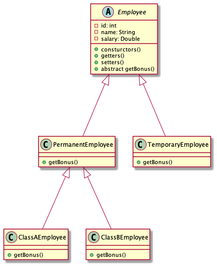

# Java bootcamp training for Target - September 2021

## You may reach me on _vinod@vinod.co_ or _9731424784_


# Assignments for Day 1

### Assignment 1

Implement the body for the following function:

```java
static boolean isValidDate(int year, int month, int day) {
	// do stuff here
	return false;
}
```

The function should check if the parameter values constitute a valid calendar date or not. Accordingly return true or false.

For example,

1. year=2018, month=13, day=1 is an invalid date as the possible values for month is 1 to 12.
2. year=2018, month=2, day=29 is an invalid date as the maximum days in February is 28 in the year 2018
3. year=2016, month=2, day=29 is a valid date.

Write a Java program to call the above function multiple times with different values.

---

### Assignment 2

Implement the body for the following function:

```java
static boolean isPrimeNumber(int num) {
	// do stuff here
	return false;
}
```

The function should check and return true only if the number passed as argument is a prime number.

Write a Java program to call the above function multiple times with different values.

---

### Assignment 3

Write a function called "sortThreeNumbers", which takes 3 distinct integers and prints them in ascending order.

```java
public void sortThreeNumbers(int a, int b, int c) {
	// do stuff here
}

```

For example,

-   sortThreeNumbers(2, 10, 1); // prints 1, 2, 10
-   sortThreeNumbers(20, 10, 1); // prints 1, 10, 20
-   sortThreeNumbers(2, 10, 100); // prints 2, 10, 100 and so on.

Write a Java program to call the above function multiple times with different values.

---

### Assignment 4

Write a function called "sumOfPrimes", that takes two integers as input and returns the sum of all the prime numbers between the same.

```java
public int sumOfPrimes(int from, int to) {
	// do stuff here
	return 0;
}
```

Write a Java program to call the above function multiple times with different values.

---

### Assignment 5

In mathematics, the Fibonacci numbers are the numbers in the following integer sequence, characterized by the fact that every number after the first two numbers is the sum of the two preceding ones:

0, 1, 1, 2, 3, 5, 8, 13, 21, 34, 55, 89, 144, ...

Write a function called "fibonacci", that takes index as paramter and returns the fibonacci number at that index.

```java
public int fibonacci(int index) {
	// do stuff here
	return 0;
}
```

---

### Assignment 6

Write a Java program to print the following pattern:

```
*
**
***
****
*****
```

The number of rows should be based on the value of a variable "num", and the number of stars in a row is based on the row number itself.

---

### Assignment 7

In trignometry, the Sine of an angle is represented by the series below:


Write a Java function that accepts angle in degrees and returns the sine of the given angle.

Call the function in main, multiple times by supplying multiple values and verify the same.

PS:

-   Divide the function into small reusable functions, if possible.
-   Do not use builtin Java classes like `Math`

---

### Assignment 8

Implement the Java function listed below:

```java
public static void printCalendar(int month, int year) {
	/// do stuff here
}
```

The function should accept `month` and `year` and print the calendar for the same. If inputs are invalid, appropriate error message/s should be printed.

Sample output for the inputs (8, 2018):

```
Su Mo Tu We Th Fr Sa
          1  2  3  4
 5  6  7  8  9 10 11
12 13 14 15 16 17 18
19 20 21 22 23 24 25
26 27 28 29 30 31
```

PS:

-   Do not use any builtin Java classes like `Date` or `Calendar`
-   Divide the function into small reusable functions, if possible.

---

### Assignment 9

Write a function called "sumOfEvensAndOdds", that takes an array of integers as input and returns another array of integers of length 2. The first element in the returned array is the sum of all even numbers in the input array, and the second element in the returned array is the sum of all odd numbers in the input array.

```java
public int[] sumOfEvensAndOdds(int []nums) {
	// do stuff here
	return null;
}
```

For example,

```java
int [] nums = {1, 2, 3, 4, 5, 6, 7, 8, 9, 10};
int [] result = sumOfEvensAndOdds(nums);
// result should be equal to {30, 25}
```

Hint:

An arrays is created as shown below:

```java
int []arr = new int[2];
arr[0] = 12;
arr[1] = 100;
```

or

```java
int []arr = {12, 100}
```

Call the function in main, multiple times by supplying multiple values and verify the same.

---

### Assignment 10

Write a function called "reverseByWords", that takes a sentence (string) as an input, and returns another string. The return value must be a sentence in which the words in the original sentence appear in reverse order.

```java
public String reverseByWords(String sentence) {
	// do stuff here
	return null;
}
```

For example,

```java
String out = reverseByWords("my name is vinod and i live in bangalore");
// the variable "out" should be equal to "bangalore in live i and vinod is name my".
```

Call the function in main, multiple times by supplying multiple values and verify the same.

---

### Assignment 11

Write a function called "inWords" that takes a number between 1 and 99,99,99,999 and returns a String representing the input number in words.

```java
public String inWords(int num) {
	// do stuff here
	return null;
}

```

For example,

```java
inWords(12345);
// should return "twelve thousand three hundred forty five"
inWords(10203040);
// should return "one crore two lakh three thousand forty"
inWords(101);
// should return "one hundred one"
```

Call the function in main, multiple times by supplying multiple values and verify the same.


# Assignments for Day 2

### Assignment 12

Create classes `Circle` and `Cylinder` as shown in the _UML_ diagram below:


In the `main()` function of a Program class, create an array of `Circle` references with the initialization shown below:

```java
Circle[] circles = {
	new Cylinder(12.34),
	new Cylinder(12.34, 10.0),
	new Cylinder(12.34, 10.0, "blue")
};

```

Print the area of the circular region of each cylinder along with the volume of the same.

---

### Assignment 13

Create the classes `Person`, `Student`, and `Staff` as shown in the _UML_ diagram below:


In the `main()` function of a Program class, create an array of `Person` references with the initialization shown below:

```java
Person[] people = {
	new Student("Shyam", "Bangalore, Karnataka", "Java fundamentals", 2010, 4500.0),
	new Staff("Anand", "Bangalore, Karnataka", "Delhi Public school", 35000.0),
	new Staff("Umesh", "Bangalore, Karnataka", "National Public school", 42000.0),
	new Student("Suresh", "Hassan, Karnataka", "Java fundamentals", 2012, 4750.0),
	new Student("Kiran", "Vasco, Goa", "Reactjs", 2017, 12500.0)
};

```

Print the details of all `Person` objects (using the `toString()`).

---

### Assignment 14

Create the classes `Shape`, `Circle`, `Rectangle`, and `Square` as shown in the _UML_ diagram below:


The `toString` function of the above classes should return text as given below:

| Classname | Sample return value from toString()                                                                                                          |
| --------- | -------------------------------------------------------------------------------------------------------------------------------------------- |
| Shape     | A Shape with color of xxx and filled/Not filled                                                                                              |
| Circle    | A Circle with radius=xxx, which is a subclass of yyy (where yyy is the output of the toString() method from the superclass)                  |
| Rectangle | A Rectangle with width=xxx and length=zzz, which is a subclass of yyy (where yyy is the output of the toString() method from the superclass) |
| Square    | A Square with side=xxx, which is a subclass of yyy (where yyy is the output of the toString() method from the superclass)                    |

In the `main()` method of a Program class, create an array of 10 `Shape` references containing a mixture of `Circle`, `Rectangle` and `Square` objects of different dimensions. Using a loop, print the `perimeter` and `area` for all of them.

---


### Assignment 15

Interface _Movable_ and its implementations _MovablePoint_ and _MovableCircle_

Write two concrete classes - MovablePoint and MovableCircle - that implement the Movable interface.


For the MovablePoint class, declare the instance variable x, y, xSpeed and ySpeed with package access as shown with '~' in the class diagram (i.e., classes in the same package can access these variables directly). For the MovableCircle class, use a MovablePoint to represent its center (which contains four variable x, y, xSpeed and ySpeed). In other words, the MovableCircle composes a MovablePoint, and its radius.

```java
public class MovablePoint implements Movable {
   // instance variables
   int x, y, xSpeed, ySpeed;     // package access

   // Constructor
   public MovablePoint(int x, int y, int xSpeed, int ySpeed) {
      this.x = x;
      ......
   }
   ......

   // Implement abstract methods declared in the interface Movable
   @Override
   public void moveUp() {
      y -= ySpeed;   // y-axis pointing down for 2D graphics
   }
   ......
}
```

```java
public class MovableCircle implements Movable { // saved as "MovableCircle.java"
   // instance variables
   private MovablePoint center;   // can use center.x, center.y directly
                                  //  because they are package accessible
   private int radius;

   // Constructor
   public MovableCircle(int x, int y, int xSpeed, int ySpeed, int radius) {
      // Call the MovablePoint's constructor to allocate the center instance.
      center = new MovablePoint(x, y, xSpeed, ySpeed);
      ......
   }
   ......

   // Implement abstract methods declared in the interface Movable
   @Override
   public void moveUp() {
      center.y -= center.ySpeed;
   }
   ......
}
```

Write a test program and try out these statements:

```java
Movable m1 = new MovablePoint(5, 6, 10, 15);     // upcast
System.out.println(m1);
m1.moveLeft();
System.out.println(m1);

Movable m2 = new MovableCircle(1, 2, 3, 4, 20);  // upcast
System.out.println(m2);
m2.moveRight();
System.out.println(m2);
```

Write a new class called _MovableRectangle_, which composes two _MovablePoint_ objects (representing the top-left and bottom-right corners) and implementing the _Movable_ Interface. Make sure that the two points has the same speed.


In the test program, add the following code to test the new implementation:

```java

Movable m3 = new MovableRectangle(1, 2, 3, 4, 25, 35);  // upcast
System.out.println(m3);
m3.moveUp();
System.out.println(m3);
```

---

### Assignment 16

Write a Java application to accept integers in a loop. After each number is accepted, the user should be asked if he/she wishes to continue. If the user inputs "NO", then the loop should be stopped and following output should be displayed:

```
Number of inputs = X
Number of integer inputs = Y
Number of non-integer inputs = Z
Sum of all integer inputs = XX
The integer inputs = N1, N2, N3, ...
The non-integer inputs = ASD, SDF, DFG, ...
X, Y, Z, etc should be actual values, based on the inputs.
```

HINT:

Use `java.util.Scanner` for accepting data from the user.

```java
Scanner s = new Scanner(System.in);
String input = s.nextLine();
int n = s.nextInt();
double d = s.nextDouble();
// ... s
```

---

### Assignment 17

Write a function called "calendar" that takes a String representing year/month in YYYY-MM format and returns a two-dimensional array representing the calendar for the input month and year.

For example, if the input is "2018-03”, then the output is:

```
{
	{0, 0, 0, 0, 1, 2, 3},
	{4, 5, 6, 7, 8, 9, 10},
	{11, 12, 13, 14, 15, 16, 17},
	{18, 19, 20, 21, 22, 23, 24},
	{25, 26, 27, 28, 29, 30, 31}
}
```

For input "2018-02", the output should be:

```
{
	{0, 0, 0, 0, 1, 2, 3},
	{4, 5, 6, 7, 8, 9 10},
	{11, 12, 13, 14, 15, 16, 17},
	{18, 19, 20, 21, 22, 23, 24},
	{25, 26, 27, 28, 0, 0, 0}
}
```

The method should throw a custom exception **InvalidDateException**, in case if the input does not represent a valid year/month combination, and **InvalidInputException** in case if the input is not in the expected YYYY-MM format.

---


---


---

### Assignment 18

Class: _com.kvinod.training.entity.Contact_

```java
public class Contact {

	private int id;
	private String firstname;
	private String lastname;
	private Gender gender = Gender.MALE;
	private String email;
	private String phone;
	private String address;
	private String city = "Bangalore";
	private String state = "Karnataka";
	private Integer pincode;
	private String country = "India";
	private Date birthDate;

	// constructor/s

	// getters and setters

   // toString

}
```

Interface _com.kvinod.training.dao.ContactsDao_

```java
public interface ContactsDao {
	// CRUD operations
	public void addContact(Contact contact) throws DaoException;
	public Contact getContact(int id) throws DaoException;
	public void updateContact(Contact contact) throws DaoException;
	public void deleteContact(int id) throws DaoException;

	// Queries
	public Contact getContactByEmail(String email) throws DaoException;
	public Contact getContactByPhone(String phone) throws DaoException;
	public List<Contact> getContactsByLastname(String lastname) throws DaoException;
	public List<Contact> getContactsByCity(String city) throws DaoException;
	public List<Contact> getContacts() throws DaoException;
	public List<Contact> getContactsByBirthDate(Date from, Date to) throws DaoException;
}
```

Create an implementation for the above interface that uses collections for storing/manipulating the data. Note that the data will be available only till the time application is running. So, initialize few contacts in the constructor.

## Create a menu driven application using Java to provide the following options:

1. Add new contact
2. List all contacts
3. Search by lastname
4. Search by email address
5. Search by phone number
6. Search by city
7. Search by date of birth range
8. Delete contact
9. Edit contact

---


---

### SOLID principles

Acronym coined by Michael Feathers in 2000s


-   S - Single Responsibility Principle (SRP)
-   O - Open/Closed Principle
-   L - Liskov's substitution Principle
-   I - Interface segregation Principle
-   D - Dependency inversion Principle

### Single Responsibility Principle (SRP)


-   Introduced by Robert C Martin (Uncle Bob)
-   Class should have one and only one responsibility
-   Class should have one reason to change
-   Every module or class should have responsibility over a single part of functionality provided by the software, and that responsibility should be entirely encapsulated by the class

Motivation:

-   Maintainability
-   Testability
-   Flexibility and extensibility
-   Parallel development
-   Loose coupling

Key points:

-   Each class and module should focus on a single task
-   Everything in the class should be related to that single purpose
-   There canbe many members in the class as long as they are related to the single responsibility
-   With SRP, classes become smaller and cleaner and the code is less fragile

Consider the class Employee:


But what if we need to save the Employee data to different system? Ex: Database, XML, JSON?


Solution according to SRP:


### Open/Closed Principle

-   Introduced by Robert C Martin
-   Classes should be open for extension but closed for modification
-   Any new functionality should be implemented by adding new classes, attributes and methods, instead of changing the existing ones

Implementation guidelines:

-   The simplest way to apply OCP is to implement the new funcationality on new derived classes
-   Allow clients to access the original class with abstract interface

If not followed:

-   End up testing the entire functionality
-   QA Team need to test the entire flow
-   Costly process for the organisation
-   Breaks the SRP
-   Maintenance overheads increase on the classes

OCP violation:

Consider the class Employee:

```java
@Data
class Employee{
    private int id;
    private String name;
    private double salary;

    public double getBonus(){
        return salary * 0.15;
    }
}
```

Now, if we have two kinds of employees, permanent and temporary, and they have different calculations for bonus:

```java
@Data
class Employee{
    private int id;
    private String name;
    private double salary;
    private String type; // "permanent" or "temporary"

    public double getBonus(){
        if(type.equals("permanent")){
            return salary * 0.15;
        }
        else if(type.equals("temporary")){
            return salary * 0.10;
        }
    }
}
```

Solution to this:



```java
class Client {
    public static void main(String[] args){
        Employee emp1 = new PermanentEmployee();
        // initialize emp1
        double bonus1 = emp1.getBonus();

        Employee emp2 = new TempararyEmployee();
        // initialize emp2
        double bonus2 = emp2.getBonus();
    }
}
```

---

### Assignment

Implement the _ContactsDao_ interface using _HashMap_ or _LinkedHashMap_ and test the functionalities of the application.

In the application, you may want to change `ContactsDao dao = new ArrayListContactsDao();` to `ContactsDao dao = new HashMapContactsDao();`.

#### Food for thought!

Is there a better way to get an object of ContactsDao interface?


---

### Assignment

Implement the _ContactsDao_ interface using JDBC and test the functionalities of the application. Also use the factory method pattern to get an object of _ContactsDao_ in your application.

---

### To run MySQL server as a docker container:

````

docker run -d -p 3306:3306 --name mysql8server --rm -e MYSQL_ROOT_PASSWORD=Welcome#123 -v mysql_data:/var/lib/mysql mysql

docker logs mysql8server

docker exec -it mysql8server sh

alternatively,

docker exec -it mysql8server mysql -uroot -pWelcome#123

```

MySQL commands:

````

show databases;
create database target_batch2_db;
use target_batch2_db;
show tables;

```

### To create a postgres docker container:

```

docker run -dp 2345:5432 --name postgres -e POSTGRES_PASSWORD=Welcome#123 -v postgres_data:/var/lib/postgresql/data postgres:alpine

docker logs postgres

docker exec -it postgres psql -U postgres

```

Some useful postgres CLI commands:

```

\l --> list all databases
\c --> connect to a database
\d --> list all tables
\dt
\dp
\z

```

```


HTTP RESPONSE CODES (FROM MOZILLA DEVELOPER NETWORK):

https://developer.mozilla.org/en-US/docs/Web/HTTP/Status#successful_responses

UDEMY COURSE LINK:

https://www.udemy.com/course/develop-java-mvc-web-apps-using-mybatis-servlets-and-jsp/?couponCode=76916B7065333B26361A


## SOAP Web service architecture


## What is a Web service?

--> Service offered/available on the web!
--> An application can make use of these services

```xml
<customer>
	<id>1122</id>
	<name>
		<first>Vinod</first>
		<last>Kumar</last>
	</name>
	<address>
		<street>1st cross 1st main</street>
		<area>ISRO layout</area>
		<city>Bangalore</city>
	</address>
</customer>
```

```java
Customer c = new Customer();
c.setId(1122);
c.setName(new Fullname("Vinod", "Kumar"));
c.setAddress(new Address("..", "..", ".."));

```

## ReSTful web services or APIs

### ReST --> Representational State Transfer

-   Transfer (exchange) of state (information) in different representations (formats)
-   Client alwasy initiates request for a resource on the server
-   Examples of state/ resources -> Flights, Products, Movies, Students, ExamResult, Employees, Accounts, Loans, ...
-   Different representations --> XML, JSON (most widely/commonly used today), CSV, plain text, html, pdf, image, ..

## 6 constraints that dictate REST

### 1. Uniform interface

-   URL or URI can be used to represent a resource
    -   http://example.com/api/books --> represents a bunch of books
    -   http://example.com/api/flights --> represents a resource of flights
    -   Use HTTP verbs GET, POST, PUT, DELETE, PATCH to access/mutate the resource
        -   For example, on the URI http://example.com/api/books/8723 a GET request should fetch the book with id 8723
        -   but the same URI with a DELETE request should simply delete the book with id 8723
        -   an update to the book can be done using the URI but with PUT or PATCH request
        -   By sending a HTTP request header called Accept we can negotiate for a specific representation
            -   For example, a GET request, with Accept="application/json" for http://example.com/api/books/8723 should return a JSON version while Accept="application/xml" should return the XML variant. This is called content negotiation (conneg)

### 2. Stateless

-   Server doesn't or needn't remember the client
-   No server side session management
-   HTTP protocol is stateless by default

### 3. Client/Server

### 4. Cacheable

### 5. Layered system

### 6. Code on demand (optional)

-   Google maps api provides services that return JSON data related to a coords, but also provides a software to draw the map on the browser/mobile app.


